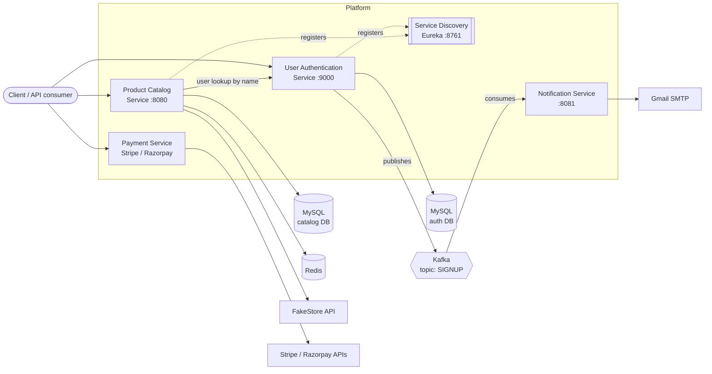
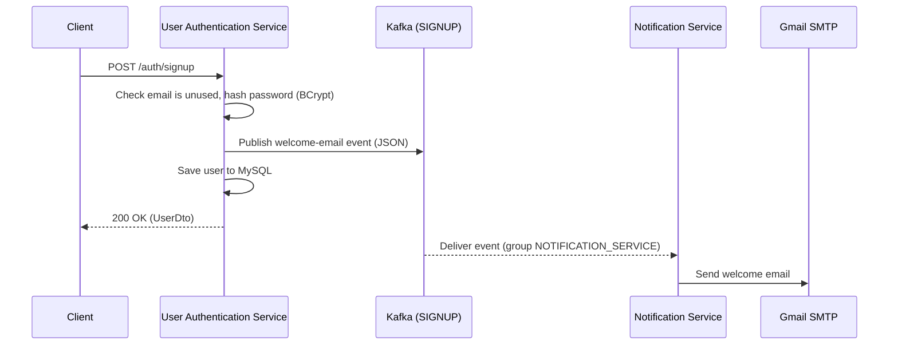

<div align="center">

# E-Commerce Backend Platform

**A microservices-based backend for an e-commerce platform, built with Spring Boot, Spring Cloud Eureka, Kafka, Redis and MySQL.**


</div>

---

## Table of Contents

- [Overview](#overview)
- [Architecture](#architecture)
- [Services](#services)
- [Tech Stack](#tech-stack)
- [Getting Started](#getting-started)
- [Try It Out](#try-it-out)
- [Project Structure](#project-structure)
- [Testing](#testing)
- [Current Scope and Notes](#current-scope-and-notes)

---

## Overview

This repository contains the backend of an e-commerce platform split into small, independently runnable services. Each service owns one responsibility and can be started, configured and evolved on its own.

**Highlights**

- **Service discovery** with Netflix Eureka; services look each other up by name instead of hard-coded addresses.
- **Session-backed JWT authentication** with BCrypt password hashing, login, logout and token validation.
- **Event-driven notifications:** signing up publishes a Kafka event, and a separate service turns it into a welcome email.
- **Cached product catalog:** product lookups are served from Redis after the first fetch; search supports paging and multi-field sorting.
- **Pluggable payment gateways** behind a common interface (Stripe and Razorpay), selected by a strategy class.

---

## Architecture



### Signup flow



---

## Services

| Service | Purpose | Port | Key technologies | Docs |
|---|---|---|---|---|
| [`service-discovery`](./service-discovery) | Eureka registry that the other services register with | `8761` | Spring Cloud Netflix Eureka Server | [README](./service-discovery/README.md) |
| [`user-authentication-service`](./user-authentication-service) | Signup, login, logout, token validation, user lookup | `9000` | Spring Security, JJWT, JPA, MySQL, Kafka producer | [README](./user-authentication-service/README.md) |
| [`product-catalog-service`](./product-catalog-service) | Product read/write APIs, Redis caching, paged search | `8080` (default) | Spring Data JPA, MySQL, Redis, Eureka client | [README](./product-catalog-service/README.md) |
| [`payment-service`](./payment-service) | Creates hosted payment links | `8080` (default, see note) | Stripe SDK, Razorpay SDK | [README](./payment-service/README.md) |
| [`notification-service`](./notification-service) | Consumes signup events and sends welcome emails | `8081` | Kafka consumer, JavaMail | [README](./notification-service/README.md) |

---

## Tech Stack

| Layer | Technology |
|---|---|
| Language / runtime | Java 17 |
| Framework | Spring Boot 3.5.x (payment-service on 4.0.1) |
| Service discovery | Spring Cloud Netflix Eureka 4.3.0 |
| Persistence | Spring Data JPA, Hibernate, MySQL (Connector/J) |
| Caching | Redis via Spring Data Redis |
| Messaging | Apache Kafka via Spring for Apache Kafka 3.3.9 |
| Security | Spring Security, BCrypt, JJWT 0.12.5 |
| Payments | Stripe Java 31.1.0, Razorpay Java 1.4.8 |
| Email | JavaMail over Gmail SMTP |
| Build | Maven (wrapper included in every service) |
| Testing | JUnit 5, Spring Boot Test, Mockito |

---

## Getting Started

Everything runs directly on your machine; no containers are required.

### Prerequisites

- **JDK 17**
- **MySQL 8** running locally, with two empty databases (one for the auth service, one for the catalog service)
- **Redis** on `localhost:6379`
- **Apache Kafka** broker reachable on port `9092`
- A **Gmail account with an app password** (only needed to send real welcome emails)
- **Stripe** and **Razorpay** API keys (only needed to use the payment service)

Maven is not required; each service ships with the Maven wrapper (`mvnw` / `mvnw.cmd`).

### 1. Clone the repository

```bash
git clone https://github.com/chandravarshith/ecommerce-backend-platform.git
cd ecommerce-backend-platform
```

### 2. Configure environment variables

Secrets and machine-specific values are read from environment variables, so nothing sensitive is committed.

| Variable | Used by | Description | Example |
|---|---|---|---|
| `Auth_DB_URL` | user-authentication-service | JDBC URL of the auth database | `jdbc:mysql://localhost:3306/auth_db` |
| `DB_URL` | product-catalog-service | JDBC URL of the catalog database | `jdbc:mysql://localhost:3306/catalog_db` |
| `DB_USERNAME` | auth, catalog | MySQL username | `root` |
| `DB_PASSWORD` | auth, catalog | MySQL password | `your_password` |
| `KAFKA_COMPUTER_IP` | auth, notification | Host of the Kafka broker (port `9092` is appended) | `localhost` |
| `EMAIL_USERNAME` | user-authentication-service | Sender address placed on the welcome email event | `you@gmail.com` |
| `EMAIL_PWD` | notification-service | Gmail app password used to authenticate over SMTP | `xxxx xxxx xxxx xxxx` |
| `STRIPE_KEY` | payment-service | Stripe secret API key | `sk_test_...` |
| `RAZORPAY_KEY_ID` | payment-service | Razorpay key ID | `rzp_test_...` |
| `RAZORPAY_KEY_SECRET` | payment-service | Razorpay key secret | `your_secret` |

Set them in your shell before starting a service.

**macOS / Linux**

```bash
export Auth_DB_URL="jdbc:mysql://localhost:3306/auth_db"
export DB_USERNAME="root"
export DB_PASSWORD="your_password"
```

**Windows (PowerShell)**

```powershell
$env:Auth_DB_URL = "jdbc:mysql://localhost:3306/auth_db"
$env:DB_USERNAME = "root"
$env:DB_PASSWORD = "your_password"
```

> Never commit real keys or passwords. Only set the variables a given service needs; each service README lists exactly which ones.

### 3. Start the infrastructure

Start MySQL, Redis and Kafka using your preferred local installation, and create the two databases:

```sql
CREATE DATABASE auth_db;
CREATE DATABASE catalog_db;
```

Tables are created automatically on first run (`spring.jpa.hibernate.ddl-auto=update`).

### 4. Start the services in order

Open one terminal per service. **Start `service-discovery` first.**

```bash
# Terminal 1: service registry (http://localhost:8761)
cd service-discovery
./mvnw spring-boot:run

# Terminal 2: authentication (port 9000)
cd user-authentication-service
./mvnw spring-boot:run

# Terminal 3: product catalog (port 8080)
cd product-catalog-service
./mvnw spring-boot:run

# Terminal 4: notification (port 8081)
cd notification-service
./mvnw spring-boot:run

# Terminal 5: payment (port 8080 by default, so override it)
cd payment-service
./mvnw spring-boot:run -Dspring-boot.run.arguments=--server.port=8082
```

On Windows use `mvnw.cmd` in place of `./mvnw`.

> **Port note:** the product catalog and payment services both default to `8080`. If you run both, start the payment service on another port as shown above.

### 5. Verify

Open the Eureka dashboard at **http://localhost:8761**. `USER-AUTHENTICATION-SERVICE` and `PRODUCTCATELOGSERVICE` should appear under *Instances currently registered with Eureka*.

---

## Try It Out

A quick end-to-end smoke test using `curl`.

**1. Sign up** (triggers the welcome email through Kafka)

```bash
curl -X POST http://localhost:9000/auth/signup \
  -H "Content-Type: application/json" \
  -d '{"name":"Asha","email":"asha@example.com","phoneNumber":"9999999999","password":"Secret@123"}'
```

**2. Log in** and read the token from the `Auth` response header

```bash
curl -i -X POST http://localhost:9000/auth/login \
  -H "Content-Type: application/json" \
  -d '{"email":"asha@example.com","password":"Secret@123"}'
```

**3. Validate the token**

```bash
curl -X POST http://localhost:9000/auth/validateToken \
  -H "Content-Type: application/json" \
  -d '{"userId":1,"token":"<paste-token-here>"}'
```

**4. Fetch a product** (the second call is served from Redis)

```bash
curl http://localhost:8080/products/1
```

**5. Create a payment link**

```bash
curl -X POST http://localhost:8082/payment \
  -H "Content-Type: application/json" \
  -d '{"amount":2000,"orderId":"ORD-1001","description":"Order ORD-1001","name":"Asha","email":"asha@example.com","phoneNumber":"9999999999"}'
```

Full endpoint references live in each service's README.

---

## Project Structure

```text
ecommerce-backend-platform/
├── service-discovery/            # Eureka server
├── user-authentication-service/  # Auth, sessions, JWT, Kafka producer
├── product-catalog-service/      # Products, search, Redis cache
├── payment-service/              # Stripe / Razorpay payment links
├── notification-service/         # Kafka consumer + email sender
├── .gitignore
└── .gitattributes
```

Each service is a self-contained Maven project with its own `pom.xml`, `mvnw` and `src/` tree.

---

## Testing

Run a service's tests from its own directory:

```bash
cd product-catalog-service
./mvnw test
```

- **product-catalog-service** includes controller tests (unit and `@WebMvcTest`) and repository tests.
- The other services include Spring context-load tests.
- Tests that boot the full Spring context expect the environment variables and backing services described above to be available.

---

## Current Scope and Notes

A few behaviours worth knowing before you build on top of this:

- **Product data source:** the product endpoints currently delegate to the public [FakeStore API](https://fakestoreapi.com), with Redis caching on lookups by id. A MySQL-backed implementation (`StorageProductService`) is included and can be selected by changing the `@Qualifier` in `ProductController`. Search always queries the MySQL `product` table.
- **Authentication scope:** the auth service issues and validates tokens, but other services do not yet enforce them; the security filter chain permits all requests.
- **Token signing key:** the JWT signing key is generated on startup, so tokens issued before a restart will no longer validate.
- **Payments:** Stripe is the active gateway; the Razorpay implementation is included and selectable in `PaymentGatewaySelectionStrategy`. The Stripe webhook endpoint currently logs the event payload.
- **Service registration:** the authentication and product catalog services register with Eureka; the notification and payment services run standalone.
