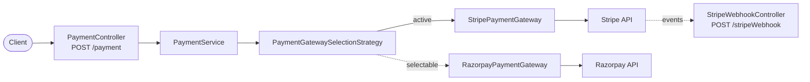

<div align="center">

# Payment Service

**Hosted payment links through Stripe or Razorpay, behind one interface.**


</div>

[← Back to platform overview](../README.md)

---

## Overview

The payment service turns a payment request into a **hosted payment link** that a customer can open to pay. It hides the choice of payment provider behind an `IPaymentGateway` interface, and a small strategy class decides which gateway handles each request.

| | |
|---|---|
| **Port** | `8080` (Spring Boot default; see [Run Locally](#run-locally)) |
| **Application name** | `payment-service` |
| **Gateways** | Stripe (active), Razorpay (implemented, selectable) |
| **Eureka** | Not registered; runs standalone |

## Architecture



**Adding a gateway** takes three steps: implement `IPaymentGateway`, expose it as a Spring bean, and return it from `PaymentGatewaySelectionStrategy.getBestPerformingPaymentGateway()`. Nothing in the controller or service changes.

## API Reference

Base URL: `http://localhost:8080` (or the port you choose)

| Method | Endpoint | Description |
|---|---|---|
| `POST` | `/payment` | Create a payment link and return its URL |
| `POST` | `/stripeWebhook` | Receive Stripe webhook events |

### `POST /payment`

**Request**

```json
{
  "amount": 2000,
  "orderId": "ORD-1001",
  "description": "Order ORD-1001",
  "name": "Asha",
  "email": "asha@example.com",
  "phoneNumber": "9999999999"
}
```

| Field | Type | Description |
|---|---|---|
| `amount` | number | Amount in the currency's **smallest unit** (for example cents) |
| `orderId` | string | Your order reference |
| `description` | string | Description of the payment |
| `name` | string | Customer name |
| `email` | string | Customer email |
| `phoneNumber` | string | Customer phone number |

**Response `200 OK`** returns the payment link as plain text:

```text
https://buy.stripe.com/test_XXXXXXXXXXXX
```

```bash
curl -X POST http://localhost:8080/payment \
  -H "Content-Type: application/json" \
  -d '{"amount":2000,"orderId":"ORD-1001","description":"Order ORD-1001","name":"Asha","email":"asha@example.com","phoneNumber":"9999999999"}'
```

### `POST /stripeWebhook`

Accepts a raw event body from Stripe and currently writes the payload to the console. Use it as the starting point for handling payment confirmation.

## Gateways

### Stripe (active)

1. Creates a **Price** for a product named `Gold Plan`, in `usd`, billed monthly, using the request's `amount`.
2. Creates a **Payment Link** for that price (quantity 1).
3. Returns the link URL. After payment, the customer is redirected to `https://woolf.university/`.

### Razorpay

Creates a payment link in `INR` using `orderId` as the reference id, with `description`, customer details, SMS and email notifications and reminders enabled, and a callback URL. It is fully wired but currently not returned by the selection strategy.

### Switching gateway

Edit `PaymentGatewaySelectionStrategy`:

```java
public IPaymentGateway getBestPerformingPaymentGateway() {
    return razorpayPaymentGateway;   // or stripePaymentGateway
}
```

## Tech Stack

- Java 17
- Spring Boot 4.0.1 (`spring-boot-starter-webmvc`)
- Stripe Java SDK 31.1.0
- Razorpay Java SDK 1.4.8
- Lombok

## Prerequisites

- JDK 17
- A [Stripe](https://dashboard.stripe.com/test/apikeys) account (test-mode secret key)
- A [Razorpay](https://dashboard.razorpay.com/app/keys) account (test key id and secret)

## Configuration

| Variable | Required | Description |
|---|---|---|
| `STRIPE_KEY` | Yes | Stripe secret API key (`sk_test_...`) |
| `RAZORPAY_KEY_ID` | Yes | Razorpay key id (`rzp_test_...`) |
| `RAZORPAY_KEY_SECRET` | Yes | Razorpay key secret |

All three are read at startup, because the Razorpay client bean is created eagerly even when Stripe is the active gateway.

```bash
export STRIPE_KEY="sk_test_..."
export RAZORPAY_KEY_ID="rzp_test_..."
export RAZORPAY_KEY_SECRET="your_secret"
```

Relevant `application.properties`:

```properties
spring.application.name=payment-service
razorpay.key.id:${RAZORPAY_KEY_ID}
razorpay.key.secret:${RAZORPAY_KEY_SECRET}
stripe.key:${STRIPE_KEY}
```

> Use **test-mode** keys while developing, and never commit keys to source control.

## Run Locally

This service does not set `server.port`, so it starts on `8080`, the same default as the product catalog service. If both run on one machine, start this one on another port:

```bash
cd payment-service
./mvnw spring-boot:run -Dspring-boot.run.arguments=--server.port=8082
```

On Windows use `mvnw.cmd spring-boot:run` with the same argument.

## Project Structure

```text
payment-service/
├── pom.xml
├── mvnw / mvnw.cmd
└── src/main/java/org/example/paymentservice/
    ├── controllers/      # PaymentController, StripeWebhookController
    ├── services/         # IPaymentService, PaymentService
    ├── paymentgateways/  # IPaymentGateway, StripePaymentGateway,
    │                     # RazorpayPaymentGateway, PaymentGatewaySelectionStrategy
    ├── configurations/   # RazorpayConfig
    └── dtos/dtos/        # CreatePaymentRequestDto
```

## Notes

- **Webhook:** `/stripeWebhook` logs the incoming payload; it does not yet verify Stripe's signature or update any order state.
- **Stripe amount and currency:** the Stripe gateway currently uses only `amount` from the request, with a fixed `usd` currency and monthly recurring price.
- **Stateless:** the service stores nothing; each call creates a new link with the provider.

## Testing

```bash
./mvnw test
```

Runs the Spring context-load test, which needs the three environment variables above.
