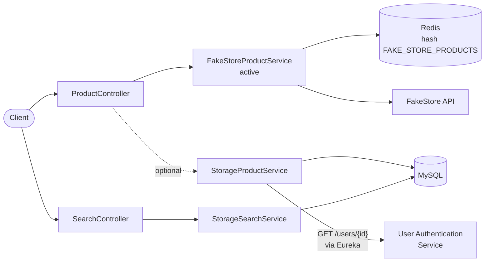
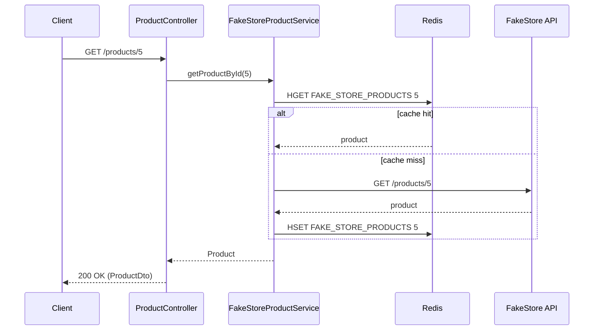
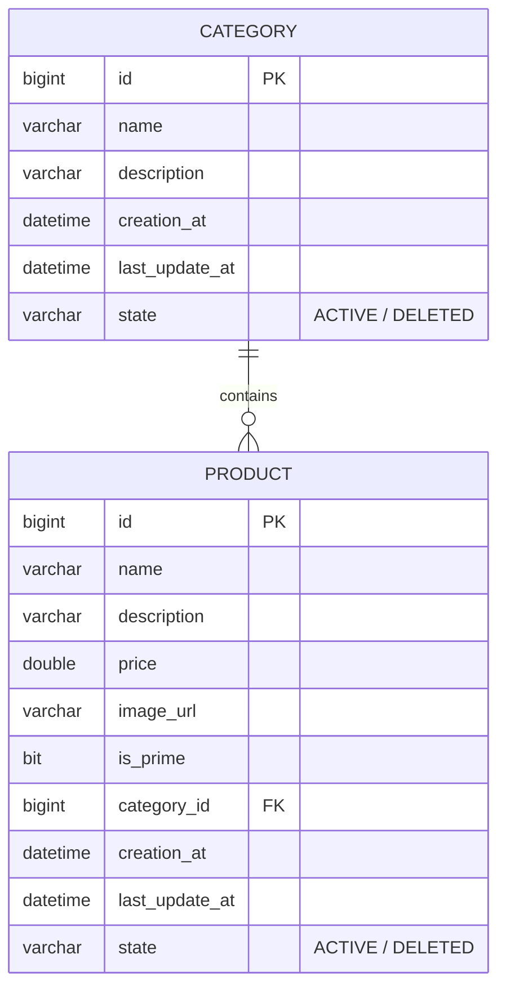

<div align="center">

# Product Catalog Service

**Product APIs with Redis caching and paged, sortable search.**


</div>

[← Back to platform overview](../README.md)

---

## Overview

The product catalog service exposes the platform's product data through a REST API. Reads by id are cached in Redis, and a separate search endpoint runs paged, multi-field sorted queries against MySQL.

The service is built around a small `IProductService` abstraction with two interchangeable implementations:

| Implementation | Data source | Status |
|---|---|---|
| `FakeStoreProductService` | The public [FakeStore API](https://fakestoreapi.com), with Redis caching | **Active by default** |
| `StorageProductService` | MySQL through Spring Data JPA; also calls the auth service over Eureka | Included; enable with a one-line change (see [Switching to MySQL storage](#switching-to-mysql-storage)) |

| | |
|---|---|
| **Port** | `8080` (Spring Boot default) |
| **Application name** | `ProductCatelogService` (registers as `PRODUCTCATELOGSERVICE`) |
| **Database** | MySQL (schema auto-managed by Hibernate) |
| **Cache** | Redis on `localhost:6379` |

## Features

- Product listing, lookup by id, create and update
- **Redis caching** of lookups by id, stored in a hash so repeat requests skip the upstream call
- **Paged search** by product name (case-insensitive, partial match) with any number of sort fields
- **Service-to-service call** to the user authentication service by name, resolved through Eureka with a load-balanced `RestTemplate`
- Centralised error handling that maps bad input to `400` and unexpected failures to `500`

## Architecture



### Cache-aside lookup (`GET /products/{id}`)



## API Reference

Base URL: `http://localhost:8080`

| Method | Endpoint | Description |
|---|---|---|
| `GET` | `/products` | List all products |
| `GET` | `/products/{id}` | Get one product (cached) |
| `POST` | `/products` | Create a product |
| `PUT` | `/products/{id}` | Replace a product |
| `GET` | `/products/{productId}/{userId}` | Get a product with the requesting user's details resolved; see [Switching to MySQL storage](#switching-to-mysql-storage) |
| `POST` | `/search` | Paged, sorted search by product name |

### Product object

```json
{
  "id": 1,
  "name": "Fjallraven Backpack",
  "description": "Your perfect pack for everyday use and walks in the forest.",
  "imageUrl": "https://example.com/image.jpg",
  "price": 109.95,
  "categoryDto": {
    "id": null,
    "name": "men's clothing",
    "description": null
  },
  "isPrime": null
}
```

### `GET /products/{id}`

```bash
curl http://localhost:8080/products/1
```

- `200 OK` with a product object.
- `400 Bad Request` if `id <= 0`, or if `id > 20` (the FakeStore catalog holds ids 1 to 20).
- The first request logs `Fetched from Fake Store`; later requests for the same id log `Found in Redis cache`.

### `POST /products`

```bash
curl -X POST http://localhost:8080/products \
  -H "Content-Type: application/json" \
  -d '{"name":"Desk Lamp","description":"LED lamp","imageUrl":"https://example.com/lamp.jpg","price":29.99,"categoryDto":{"name":"electronics"}}'
```

Returns `201 Created` with the created product. Against FakeStore, writes are simulated by the upstream API and are not persisted.

### `PUT /products/{id}`

Same body as `POST`; returns `200 OK` with the updated product.

### `POST /search`

Searches the MySQL `product` table by name.

**Request**

```json
{
  "query": "lamp",
  "pageNumber": 0,
  "pageSize": 10,
  "sortParams": [
    { "sortBy": "price", "sortOrder": "ASC" },
    { "sortBy": "id", "sortOrder": "DESC" }
  ]
}
```

| Field | Description |
|---|---|
| `query` | Text to match anywhere in the product name (case-insensitive) |
| `pageNumber` | Zero-based page index |
| `pageSize` | Number of results per page |
| `sortParams` | One or more sort rules, applied in order. `sortOrder` is `ASC` or `DESC`. Provide at least one. |

**Response `200 OK`** is a Spring Data `Page` (abbreviated):

```json
{
  "content": [
    {
      "id": 7,
      "name": "Desk Lamp",
      "price": 29.99,
      "imageUrl": "https://example.com/lamp.jpg",
      "isPrime": true,
      "state": "ACTIVE",
      "category": { "id": 2, "name": "electronics", "description": "Gadgets" }
    }
  ],
  "totalElements": 1,
  "totalPages": 1,
  "number": 0,
  "size": 10
}
```

### Errors

| Status | Cause |
|---|---|
| `400 Bad Request` | `IllegalArgumentException`, for example an invalid product id |
| `500 Internal Server Error` | Any other `RuntimeException`; the message is returned as plain text |

## Data Model

Used by `StorageProductService` and the search endpoint. Hibernate creates the tables automatically.



> Ids are **not auto-generated**; supply an `id` when inserting products or categories.

## Tech Stack

- Java 17, Spring Boot 3.5.7
- Spring Web, Spring Data JPA, Spring Data Redis
- MySQL with Connector/J 9.4.0
- Spring Cloud Netflix Eureka Client 4.3.0 with a `@LoadBalanced` `RestTemplate`
- Lombok
- JUnit 5, Mockito, Spring Boot Test

## Prerequisites

- JDK 17
- A running MySQL instance with an empty database (for example `catalog_db`)
- Redis on `localhost:6379`
- The [service registry](../service-discovery/README.md) running on `localhost:8761`
- Internet access to reach `fakestoreapi.com` (for the default data source)

## Configuration

| Variable | Required | Description | Example |
|---|---|---|---|
| `DB_URL` | Yes | JDBC URL of the catalog database | `jdbc:mysql://localhost:3306/catalog_db` |
| `DB_USERNAME` | Yes | MySQL username | `root` |
| `DB_PASSWORD` | Yes | MySQL password | `your_password` |

```bash
export DB_URL="jdbc:mysql://localhost:3306/catalog_db"
export DB_USERNAME="root"
export DB_PASSWORD="your_password"
```

Relevant `application.properties`:

```properties
spring.application.name=ProductCatelogService
spring.jpa.hibernate.ddl-auto=update
spring.datasource.url=${DB_URL}
spring.datasource.username=${DB_USERNAME}
spring.datasource.password=${DB_PASSWORD}
spring.data.redis.host=localhost
spring.data.redis.port=6379
eureka.client.register-with-eureka=true
eureka.client.fetch-registry=true
```

To use a different port (for example when running alongside the payment service), add `server.port` or pass it on the command line:

```bash
./mvnw spring-boot:run -Dspring-boot.run.arguments=--server.port=8083
```

## Run Locally

```bash
cd product-catalog-service
./mvnw spring-boot:run
```

On Windows use `mvnw.cmd spring-boot:run`.

## Switching to MySQL Storage

By default `ProductController` injects the FakeStore-backed implementation:

```java
@Autowired
@Qualifier("fakeStoreProductService")
private IProductService productService;
```

To serve products from your own MySQL database instead, change the qualifier to `storageProductService`. That switch also enables `GET /products/{productId}/{userId}`, which loads the product from MySQL and then calls `http://user-authentication-service/users/{userId}` through Eureka to resolve the user (so the auth service must be running and registered).

With the default FakeStore implementation, `GET /products/{productId}/{userId}` returns `500` because role-based lookup is only implemented for MySQL storage.

## Project Structure

```text
product-catalog-service/
├── pom.xml
├── mvnw / mvnw.cmd
└── src/
    ├── main/java/org/example/productcatelogservice/
    │   ├── controllers/      # ProductController, SearchController, ControllerAdvisor
    │   ├── services/         # IProductService, FakeStoreProductService, StorageProductService,
    │   │                     # ISearchService, StorageSearchService
    │   ├── repositories/     # ProductRepository, CategoryRepository
    │   ├── models/           # BaseClass, Product, Category, State
    │   ├── dtos/             # ProductDto, CategoryDto, SearchRequestDto, SortParam, ...
    │   ├── clients/          # FakeStoreApiClient
    │   ├── configurations/   # RedisConfiguration, RestTemplateConfiguration
    │   └── utils/            # RestTemplateUtil
    └── test/java/org/example/productcatelogservice/
        ├── controllers/      # ProductControllerTest, ProductControllerMvcTest
        └── repositories/     # ProductRepositoryTest, CategoryRepositoryTest
```

## Notes

- **Cache scope:** only lookups by id are cached, in the Redis hash `FAKE_STORE_PRODUCTS` (field = product id). No expiry is configured, so entries stay until Redis is flushed.
- **Search source:** `/search` always queries the MySQL `product` table, so it returns results only once that table has data.
- **Delete:** `removeProduct` exists in the service layer but no `DELETE` endpoint is exposed yet.

## Testing

```bash
./mvnw test
```

| Test class | Type | Covers |
|---|---|---|
| `ProductControllerTest` | Unit (Mockito) | Valid and invalid ids, exception propagation, delegation to the service |
| `ProductControllerMvcTest` | `@WebMvcTest` | List and create endpoints over HTTP |
| `ProductRepositoryTest` | `@SpringBootTest` | Repository queries |
| `CategoryRepositoryTest` | `@SpringBootTest` | Category loading |

Tests annotated with `@SpringBootTest` boot the full context, so the environment variables above and a reachable MySQL and Redis are required.
