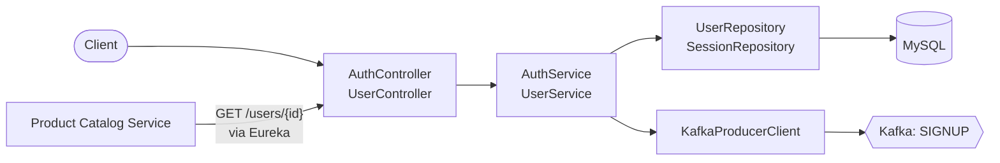
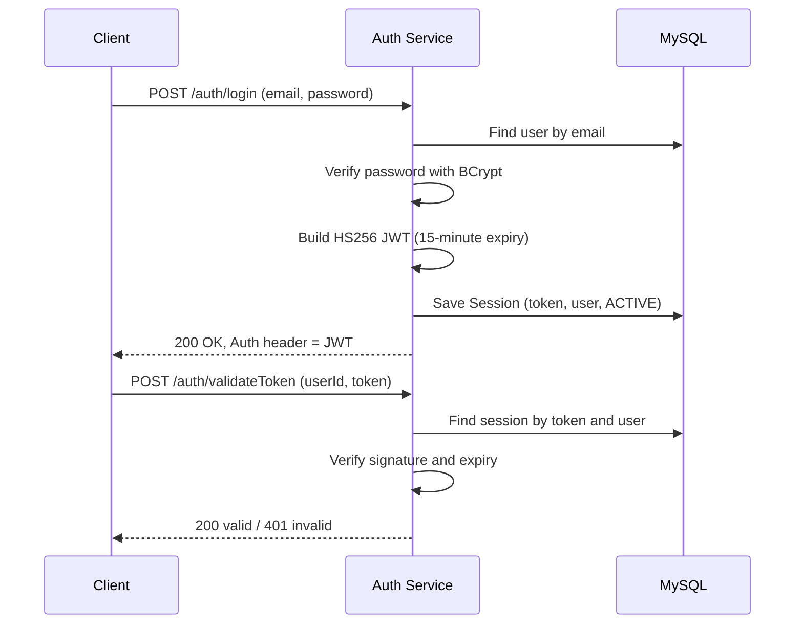
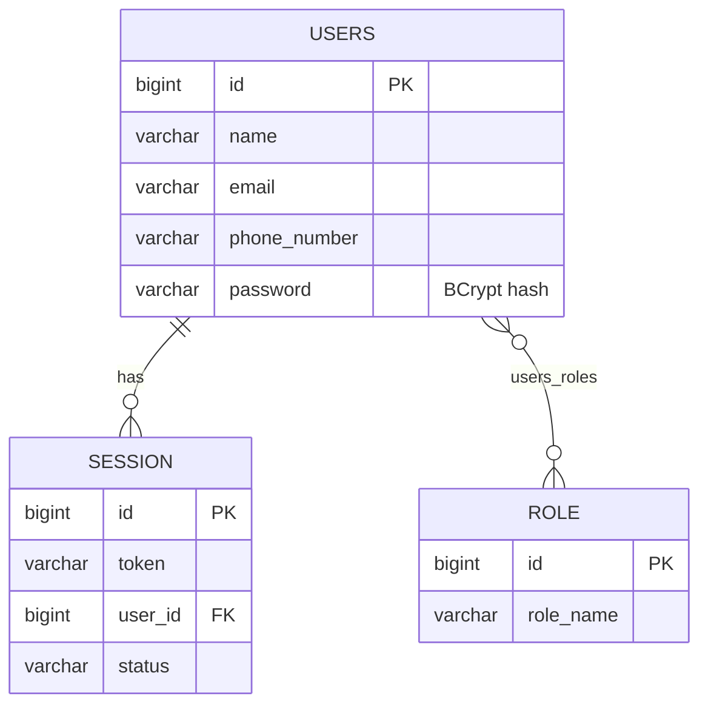

<div align="center">

# User Authentication Service

**Signup, login, logout and token validation for the E-Commerce Backend Platform.**


</div>

[← Back to platform overview](../README.md)

---

## Overview

This service owns user identity. It registers users, verifies credentials, issues signed JWTs, and records each login as a **session** in MySQL. When a user signs up it also publishes an event to Kafka so the [notification service](../notification-service/README.md) can send a welcome email.

| | |
|---|---|
| **Port** | `9000` |
| **Application name** | `user-authentication-service` |
| **Eureka** | Registers as `USER-AUTHENTICATION-SERVICE` |
| **Database** | MySQL (schema auto-managed by Hibernate) |
| **Publishes** | Kafka topic `SIGNUP` |

## Features

- Registration with duplicate-email detection and **BCrypt** password hashing
- Login that returns a **signed JWT (HS256)** in the `Auth` response header
- Server-side **session records**: every login is stored, and logout marks the session `INACTIVE`
- Token validation that checks the session record exists, verifies the signature and enforces the token's expiry
- User lookup by id, used by other services through Eureka
- Welcome-email event published to Kafka on signup

## Architecture



### Login and validation flow



## API Reference

Base URL: `http://localhost:9000`

| Method | Endpoint | Description |
|---|---|---|
| `POST` | `/auth/signup` | Register a new user |
| `POST` | `/auth/login` | Authenticate and receive a JWT |
| `POST` | `/auth/logout` | End a session |
| `POST` | `/auth/validateToken` | Check that a token is valid for a user |
| `GET` | `/users/{id}` | Fetch a user's details |

### `POST /auth/signup`

**Request**

```json
{
  "name": "Asha",
  "email": "asha@example.com",
  "phoneNumber": "9999999999",
  "password": "Secret@123"
}
```

**Response `200 OK`**

```json
{
  "id": 1,
  "email": "asha@example.com",
  "name": "Asha",
  "roles": []
}
```

**Errors:** `400 Bad Request` with `User with this email already exists`.

### `POST /auth/login`

**Request**

```json
{
  "email": "asha@example.com",
  "password": "Secret@123"
}
```

**Response `200 OK`** returns the same user body as signup, with the token in a response header:

```text
Auth: eyJhbGciOiJIUzI1NiJ9....
```

**Errors:** `404 Not Found` (`User not registered`), `400 Bad Request` (`Invalid password`).

### `POST /auth/logout`

**Request**

```json
{
  "userId": 1,
  "token": "<jwt>"
}
```

**Response `200 OK`** with a plain-text body: `Logout Successful`, or `Logout Failed, No Active Session` if the session does not exist or is already inactive.

### `POST /auth/validateToken`

**Request**

```json
{
  "userId": 1,
  "token": "<jwt>"
}
```

**Responses**

| Status | Body | Meaning |
|---|---|---|
| `200 OK` | `Token validated successfully` | A session exists for the token and the token has not expired |
| `401 Unauthorized` | `Invalid token` | No matching session, or the token has expired |

### `GET /users/{id}`

**Response `200 OK`**

```json
{
  "id": 1,
  "email": "asha@example.com",
  "name": "Asha",
  "roles": []
}
```

**Errors:** `404 Not Found` with `User not Found`.

## Token Details

| Property | Value |
|---|---|
| Algorithm | HS256 |
| Lifetime | 15 minutes |
| Claims | `user_id`, `issued_by`, `iat`, `exp`, `roles` |
| Transport | `Auth` response header on login |

## Data Model

Hibernate creates and updates these tables automatically. All entities extend a base class that adds `id`, `created_at`, `updated_at` and `status` (`ACTIVE` / `INACTIVE`).



## Tech Stack

- Java 17, Spring Boot 3.5.7
- Spring Web, Spring Data JPA, Spring Security
- JJWT 0.12.5 (`jjwt-api`, `jjwt-impl`, `jjwt-jackson`)
- MySQL with Connector/J
- Spring for Apache Kafka 3.3.9
- Spring Cloud Netflix Eureka Client 4.3.0
- Lombok

## Prerequisites

- JDK 17
- A running MySQL instance with an empty database (for example `auth_db`)
- A running Kafka broker on port `9092`
- The [service registry](../service-discovery/README.md) running on `localhost:8761`

## Configuration

| Variable | Required | Description | Example |
|---|---|---|---|
| `Auth_DB_URL` | Yes | JDBC URL of the auth database | `jdbc:mysql://localhost:3306/auth_db` |
| `DB_USERNAME` | Yes | MySQL username | `root` |
| `DB_PASSWORD` | Yes | MySQL password | `your_password` |
| `KAFKA_COMPUTER_IP` | Yes | Kafka broker host (port `9092` is appended) | `localhost` |
| `EMAIL_USERNAME` | Yes | Sender address included in the welcome email event | `you@gmail.com` |

```bash
export Auth_DB_URL="jdbc:mysql://localhost:3306/auth_db"
export DB_USERNAME="root"
export DB_PASSWORD="your_password"
export KAFKA_COMPUTER_IP="localhost"
export EMAIL_USERNAME="you@gmail.com"
```

Relevant `application.properties`:

```properties
spring.application.name=user-authentication-service
server.port=9000
spring.jpa.hibernate.ddl-auto=update
spring.datasource.url=${Auth_DB_URL}
spring.datasource.username=${DB_USERNAME}
spring.datasource.password=${DB_PASSWORD}
spring.kafka.bootstrap-servers=${KAFKA_COMPUTER_IP}:9092
email.username=${EMAIL_USERNAME}
eureka.client.register-with-eureka=true
eureka.client.fetch-registry=true
```

## Run Locally

```bash
cd user-authentication-service
./mvnw spring-boot:run
```

On Windows use `mvnw.cmd spring-boot:run`. Once started, the service appears on the Eureka dashboard at http://localhost:8761.

### Quick test

```bash
# Sign up
curl -X POST http://localhost:9000/auth/signup \
  -H "Content-Type: application/json" \
  -d '{"name":"Asha","email":"asha@example.com","phoneNumber":"9999999999","password":"Secret@123"}'

# Log in (-i shows the Auth header)
curl -i -X POST http://localhost:9000/auth/login \
  -H "Content-Type: application/json" \
  -d '{"email":"asha@example.com","password":"Secret@123"}'
```

## Project Structure

```text
user-authentication-service/
├── pom.xml
├── mvnw / mvnw.cmd
└── src/main/java/org/example/userauthenticationservice/
    ├── controllers/      # AuthController, UserController, ControllerAdvisor
    ├── services/         # AuthService, UserService (+ interfaces)
    ├── repositories/     # UserRepository, SessionRepository
    ├── models/           # BaseModel, User, Role, Session, Status
    ├── dtos/             # request and response objects
    ├── exceptions/       # UserExistException, UserNotRegisteredException, InvalidPasswordException
    ├── clients/          # KafkaProducerClient
    ├── configurations/   # SecurityConfig, OAuthConfig
    ├── oauth/            # CustomUserDetails, CustomUserDetailsService
    └── utils/            # UserUtils
```

## Notes

- **Signing key:** the HS256 key is generated each time the service starts, so tokens issued before a restart will fail validation.
- **Logout and validation:** logout marks the session `INACTIVE`, but `/auth/validateToken` currently checks only that a session exists and that the token is unexpired, so a logged-out token still validates until its 15-minute expiry.
- **Open endpoints:** the Spring Security filter chain currently permits all requests; authentication is performed by calling `/auth/validateToken`.
- **Roles:** the `roles` relationship exists on users, and roles are returned in responses and embedded in the JWT. There is no endpoint yet for assigning roles.
- **OAuth scaffolding:** `OAuthConfig` includes an in-memory registered client and RSA key source for Spring Authorization Server. The REST endpoints above use the custom JWT flow instead.
- **Kafka dependency:** signup publishes to Kafka, so the broker should be running when users register.
- **Logging:** SQL statements and Spring Security trace logs are enabled by default, which is useful while developing and noisy elsewhere.

## Testing

```bash
./mvnw test
```

Runs the Spring context-load test, which needs the environment variables above and the backing services to be available.
